<p align="center">
  <picture>
    <source media="(prefers-color-scheme: dark)" srcset="./.github/text-logo.svg">
    
  </picture>
</p>

<h3 align="center">Ícones de tecnologias em um único SVG, para README e currículo</h3>

<p align="center">
  <picture>
    <source media="(prefers-color-scheme: dark)" srcset="./brand/compact-dark.svg">
    
  </picture>
  &nbsp;·&nbsp; fork de <a href="https://skillicons.dev">skillicons.dev</a>
  &nbsp;·&nbsp; <strong>255 ícones</strong>
  &nbsp;·&nbsp; <a href="./DEPLOY.md">Vercel</a> ou Cloudflare Workers
</p>

<hr>

## Índice

- [Como funciona](#como-funciona)
- [Especificar ícones](#especificar-ícones)
- [Temas](#temas)
- [Ícones por linha](#ícones-por-linha)
- [Centralizar](#centralizar)
- [Ícones da marca `<gcruz.dev/>`](#ícones-da-marca-gcruzdev)
- [Referência da API](#referência-da-api)
- [Lista de ícones](#lista-de-ícones)
- [Estrutura do repositório](#estrutura-do-repositório)
- [Adicionar um ícone](#adicionar-um-ícone)
- [Créditos e licença](#créditos-e-licença)

## Como funciona

Um endpoint recebe a lista de ícones e devolve **um único SVG** com todos eles
lado a lado. Uma requisição por badge, não uma por ícone.

```
https://icons.gcruz.dev.br/icons?i=ts,react,nodejs,docker
```

> [!IMPORTANT]
> `icons.gcruz.dev.br` é a instância **deste fork**. Troque pelo domínio da sua.
> Os 16 ícones criados aqui — entre eles `oracle`, `sql`, `jwt`, `render` e
> `gcruz` — **não existem em `skillicons.dev`**, que serve apenas o repositório
> oficial. Pedir um deles ao domínio oficial devolve `400`.
> Como publicar a sua instância: [DEPLOY.md](./DEPLOY.md).

As prévias deste README vêm dos arquivos do próprio repositório, então aparecem
mesmo antes de você publicar a instância.

## Especificar ícones

Liste os IDs separados por vírgula em `i` (ou `icons`). A lista completa está em
[Lista de ícones](#lista-de-ícones).

```md
[](https://gcruz.dev.br)
```

<p>
  
  
  
  
</p>

`i=all` devolve todos os 255 de uma vez.

## Temas

Parte dos ícones tem variante clara e escura — são **174** dos 255. `theme` (ou
`t`) escolhe qual usar; o padrão é `dark`. O nome se refere ao **fundo** do badge.

```md
[](https://gcruz.dev.br)
```

<p>
  
  
  
  
</p>

Os 81 ícones restantes usam a cor da própria marca como fundo e ficam idênticos
nos dois temas — `theme` simplesmente não os afeta.

## Ícones por linha

`perline` aceita de **1 a 50**; o padrão é 15. Fora desse intervalo a resposta é
`400`.

```md
[](https://gcruz.dev.br)
```

## Centralizar

O SVG é redimensionado automaticamente, então vale qualquer técnica de
centralização de imagem:

```html
<p align="center">
  <a href="https://gcruz.dev.br">
    
  </a>
</p>
```

## Ícones da marca `<gcruz.dev/>`

A marca é **100% tipográfica** em JetBrains Mono. Os arquivos são os contornos
dos glifos convertidos em `<path>`: não dependem de fonte instalada e preservam a
proporção original. Todos os assets estão em [`brand/`](./brand/), e
[`brand/index.html`](./brand/index.html) é o documento de decisão do design
system, com escala, pesos e contexto de aplicação.

### No endpoint, como qualquer outro ícone

`gcruz` é um ID normal da API e se combina com os demais na mesma requisição:

```md
[](https://gcruz.dev.br)
[](https://gcruz.dev.br)
```

<p>
  <picture>
    <source media="(prefers-color-scheme: dark)" srcset="./icons/GCruz-Dark.svg">
    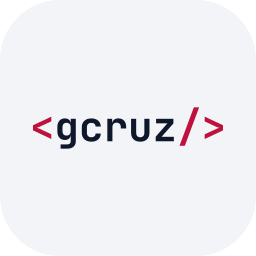
  </picture>
  
  
  
</p>

No badge quadrado entra a variante **compacta** `<g/>`, e não o wordmark. Essa é a
regra do próprio design system para tamanho pequeno: com 12 caracteres, o wordmark
teria cerca de 4px de altura num badge de 48px. O wordmark completo vive em
`brand/`, onde a proporção é livre.

### Assets da marca

Variações definidas no design system:

| Nome                                          | Prévia                                                                                                                                                                           | Formato | Dimensões     | Link direto                                                                                                                                                                                               |
| :-------------------------------------------- | :------------------------------------------------------------------------------------------------------------------------------------------------------------------------------- | :------ | :------------ | :-------------------------------------------------------------------------------------------------------------------------------------------------------------------------------------------------------- |
| **Wordmark**<br><code>wordmark</code>         | <picture><source media="(prefers-color-scheme: dark)" srcset="./brand/wordmark-dark.svg"></picture>             | `.svg`  | `704.8 × 101` | [dark](https://raw.githubusercontent.com/https-shini/skill-icons/main/brand/wordmark-dark.svg) · [light](https://raw.githubusercontent.com/https-shini/skill-icons/main/brand/wordmark-light.svg)         |
| **Wordmark 600**<br><code>wordmark-600</code> | <picture><source media="(prefers-color-scheme: dark)" srcset="./brand/wordmark-600-dark.svg"></picture> | `.svg`  | `704.4 × 101` | [dark](https://raw.githubusercontent.com/https-shini/skill-icons/main/brand/wordmark-600-dark.svg) · [light](https://raw.githubusercontent.com/https-shini/skill-icons/main/brand/wordmark-600-light.svg) |
| **Compacta**<br><code>compact</code>          | <picture><source media="(prefers-color-scheme: dark)" srcset="./brand/compact-dark.svg"></picture>                 | `.svg`  | `224.8 × 101` | [dark](https://raw.githubusercontent.com/https-shini/skill-icons/main/brand/compact-dark.svg) · [light](https://raw.githubusercontent.com/https-shini/skill-icons/main/brand/compact-light.svg)           |
| **Tile de app**<br><code>app-tile</code>      | <picture><source media="(prefers-color-scheme: dark)" srcset="./brand/app-tile-dark.svg">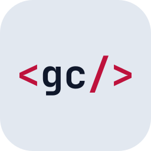</picture>              | `.svg`  | `256 × 256`   | [dark](https://raw.githubusercontent.com/https-shini/skill-icons/main/brand/app-tile-dark.svg) · [light](https://raw.githubusercontent.com/https-shini/skill-icons/main/brand/app-tile-light.svg)         |
| **Favicon**<br><code>favicon</code>           | <picture><source media="(prefers-color-scheme: dark)" srcset="./brand/favicon-dark.svg"></picture>                 | `.svg`  | `64 × 64`     | [dark](https://raw.githubusercontent.com/https-shini/skill-icons/main/brand/favicon-dark.svg) · [light](https://raw.githubusercontent.com/https-shini/skill-icons/main/brand/favicon-light.svg)           |
| **Peso 400**<br><code>peso-400</code>         | <picture><source media="(prefers-color-scheme: dark)" srcset="./brand/peso-400-dark.svg"></picture>             | `.svg`  | `703 × 101`   | [dark](https://raw.githubusercontent.com/https-shini/skill-icons/main/brand/peso-400-dark.svg) · [light](https://raw.githubusercontent.com/https-shini/skill-icons/main/brand/peso-400-light.svg)         |
| **Peso 500**<br><code>peso-500</code>         | <picture><source media="(prefers-color-scheme: dark)" srcset="./brand/peso-500-dark.svg"></picture>             | `.svg`  | `703.8 × 101` | [dark](https://raw.githubusercontent.com/https-shini/skill-icons/main/brand/peso-500-dark.svg) · [light](https://raw.githubusercontent.com/https-shini/skill-icons/main/brand/peso-500-light.svg)         |

Variações **propostas** — não constam do DS v4.0, foram derivadas e estão aqui
para aprovação:

| Nome                                            | Prévia                                                                                                                                                                                          | Formato | Dimensões       | Link direto                                                                                                                                                                                                         |
| :---------------------------------------------- | :---------------------------------------------------------------------------------------------------------------------------------------------------------------------------------------------- | :------ | :-------------- | :------------------------------------------------------------------------------------------------------------------------------------------------------------------------------------------------------------------ |
| **Vertical**<br><code>proposta-vertical</code>  | <picture><source media="(prefers-color-scheme: dark)" srcset="./brand/proposta-vertical-dark.svg">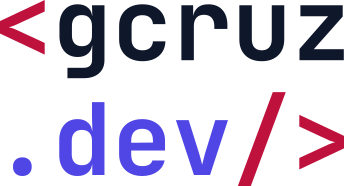</picture> | `.svg`  | `344.8 × 186.3` | [dark](https://raw.githubusercontent.com/https-shini/skill-icons/main/brand/proposta-vertical-dark.svg) · [light](https://raw.githubusercontent.com/https-shini/skill-icons/main/brand/proposta-vertical-light.svg) |
| **Sem texto**<br><code>proposta-brackets</code> | <picture><source media="(prefers-color-scheme: dark)" srcset="./brand/proposta-brackets-dark.svg"></picture>  | `.svg`  | `164.8 × 94`    | [dark](https://raw.githubusercontent.com/https-shini/skill-icons/main/brand/proposta-brackets-dark.svg) · [light](https://raw.githubusercontent.com/https-shini/skill-icons/main/brand/proposta-brackets-light.svg) |
| **Monograma**<br><code>proposta-monogram</code> | <picture><source media="(prefers-color-scheme: dark)" srcset="./brand/proposta-monogram-dark.svg"></picture>  | `.svg`  | `45.1 × 74`     | [dark](https://raw.githubusercontent.com/https-shini/skill-icons/main/brand/proposta-monogram-dark.svg) · [light](https://raw.githubusercontent.com/https-shini/skill-icons/main/brand/proposta-monogram-light.svg) |

### Código pronto

Os links da coluna _Link direto_ são servidos pelo GitHub com
`content-type: image/svg+xml` e funcionam imediatamente, sem depender do deploy.
Publicada a instância, os mesmos arquivos ficam também em `/brand/<arquivo>.svg`.

```html
<!-- Wordmark — Assinatura principal, peso 700. Use até 32px de altura. -->


<!-- Wordmark 600 — Mesma assinatura em peso 600, para display a partir de 40px. -->


<!-- Compacta — `<g/>`. Abaixo de 24px é a única variante legível. -->


<!-- Tile de app — Ícone de aplicativo, quadrado, com tile e aresta. -->


<!-- Favicon — Otimizado para 16px na aba do navegador. -->


<!-- Peso 400 — Só para comparação de pesos no documento do DS. -->


<!-- Peso 500 — Só para comparação de pesos no documento do DS. -->

```

Propostas:

```html
<!-- Vertical — `<gcruz` sobre `.dev/>`, empilhado. -->


<!-- Sem texto — Só os brackets, sem o nome. -->


<!-- Monograma — O `g` isolado, sem brackets. -->

```

Para alternar por tema, use `<picture>` — é o método documentado pelo GitHub para
imagem por esquema de cor:

```html
<picture>
  <source
    media="(prefers-color-scheme: dark)"
    srcset="
      https://raw.githubusercontent.com/https-shini/skill-icons/main/brand/wordmark-dark.svg
    "
  />
  
</picture>
```

### Tokens

| Elemento          | Dark      | Light     |
| :---------------- | :-------- | :-------- |
| Fundo             | `#070d19` | `#f2f4f8` |
| Brackets `<` `/>` | `#f43f5e` | `#be123c` |
| Nome `gcruz`      | `#f8fafc` | `#0f172a` |
| Sufixo `.dev`     | `#818cf8` | `#4f46e5` |
| Tile da compacta  | `#0f172a` | —         |

Peso **700 até 32px**, **600 acima de 40px**. Abaixo de 24px, use a compacta.

> [!NOTE]
> `peso-700` é byte a byte idêntico a `wordmark`, e `peso-600` a `wordmark-600` —
> são o mesmo arquivo sob dois nomes. Os pesos existem para a comparação no
> documento do DS; para uso real, prefira `wordmark` e `wordmark-600`.

## Referência da API

| Rota                   | Devolve                                                    |
| :--------------------- | :--------------------------------------------------------- |
| `/icons?i=js,html`     | O SVG composto. Aceita `i` ou `icons`.                     |
| `/icons?i=all`         | Todos os ícones.                                           |
| `&theme=light`         | Fundo claro nos ícones com par. Padrão `dark`. Aceita `t`. |
| `&perline=9`           | Ícones por linha, de 1 a 50. Padrão 15.                    |
| `/api/icons`           | JSON com a lista de IDs.                                   |
| `/api/manifest`        | JSON com ID, se tem tema e o arquivo de cada variante.     |
| `/api/svgs`            | JSON com todos os SVGs crus.                               |
| `/svg/<Arquivo>.svg`   | O SVG individual, estático e cacheado na CDN.              |
| `/brand/<arquivo>.svg` | Os assets da marca.                                        |

Erros:

| Requisição        | Resposta                                                   |
| :---------------- | :--------------------------------------------------------- |
| `?i=js,naoexiste` | `400 Unknown icon: naoexiste` — nomeia o que não resolveu. |
| `?perline=0`      | `400` — fora do intervalo 1–50.                            |
| `?theme=azul`     | `400` — só `dark` ou `light`.                              |
| `/icons` sem `i`  | `400` — nenhum ícone especificado.                         |

Atalhos de nome: 44 aliases estão definidos em `shortNames`, em
[`lib/icons.mjs`](./lib/icons.mjs) — `js`, `ts`, `py`, `k8s`, `rr`, `fa`, `ws`,
`rtl`, entre outros.

## Lista de ícones

Tabela gerada a partir de [`icons/`](./icons) por
[`scripts/readme-table.mjs`](./scripts/readme-table.mjs). Para regenerar:
`npm run readme`. O CI roda `npm run readme:check` e falha se ela estiver
defasada.

|      Icon ID       |                          Icon                          |
| :----------------: | :----------------------------------------------------: |
|     `ableton`      |         |
|   `activitypub`    |     |
|      `actix`       |           |
|      `adonis`      |               |
|        `ae`        |         |
|        `ai`        |          |
|     `aiscript`     |        |
|     `alpinejs`     |        |
|     `anaconda`     |        |
|  `androidstudio`   |   |
|     `angular`      |         |
|     `ansible`      |              |
|      `apollo`      |               |
|      `apple`       |     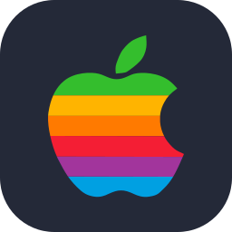      |
|     `appwrite`     |             |
|       `arch`       |      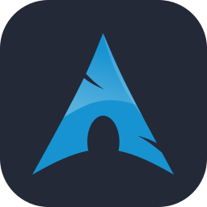      |
|     `arduino`      |              |
|      `astro`       |                |
|       `atom`       |                 |
|        `au`        |             |
|     `autocad`      |         |
|       `aws`        |             |
|       `azul`       |                 |
|      `azure`       |           |
|      `babel`       |                |
|       `bash`       |            |
|       `bevy`       |            |
|    `bitbucket`     |   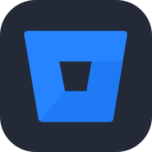    |
|     `blender`      |         |
|    `bootstrap`     |            |
|       `bots`       |          |
|       `bsd`        |             |
|       `bun`        |             |
|        `c`         |                    |
|    `capacitor`     |      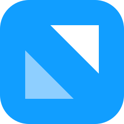      |
|    `cassandra`     |       |
|      `clion`       |     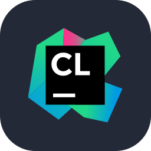      |
|     `clojure`      |         |
|    `cloudflare`    |      |
|      `cmake`       |           |
|     `codepen`      |         |
|   `coffeescript`   |    |
|       `cpp`        |                  |
|     `crystal`      |         |
|        `cs`        |                   |
|       `css`        |                  |
|     `cypress`      |    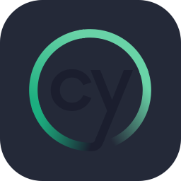     |
|        `d3`        |              |
|       `dart`       |            |
|      `debian`      |     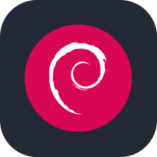     |
|       `deno`       |            |
|      `devto`       |     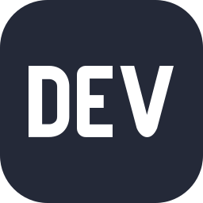      |
|     `discord`      |              |
|    `discordjs`     |   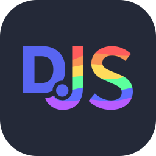    |
|      `django`      |               |
|      `docker`      |               |
|      `dotnet`      |               |
|     `dynamodb`     |        |
|     `eclipse`      |         |
|  `elasticsearch`   |   |
|     `electron`     |             |
|      `elixir`      |          |
|      `elysia`      |     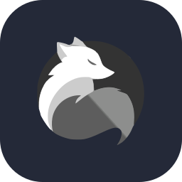     |
|      `emacs`       |                |
|      `ember`       |                |
|     `emotion`      |         |
|      `eslint`      |       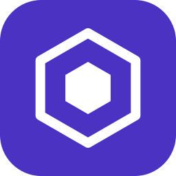        |
|     `express`      |       |
|     `fastapi`      |              |
|    `fediverse`     |       |
|      `figma`       |           |
|     `firebase`     |        |
|      `flask`       |           |
|     `flutter`      |         |
|   `fontawesome`    |          |
|      `forth`       |                |
|     `fortran`      |              |
| `gamemakerstudio`  |      |
|      `gatsby`      |               |
|       `gcp`        |             |
|      `gcruz`       |     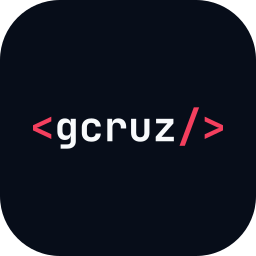      |
|     `gherkin`      |         |
|       `git`        |                  |
|      `github`      |          |
|  `githubactions`   |   |
|      `gitlab`      |          |
|      `gmail`       |           |
|        `go`        |               |
|      `godot`       |           |
|      `gradle`      |          |
|     `grafana`      |         |
|     `graphql`      |         |
|       `gtk`        |             |
|       `gulp`       |                 |
|     `haskell`      |         |
|       `haxe`       |            |
|    `haxeflixel`    |      |
|      `heroku`      |               |
|    `hibernate`     |       |
|       `html`       |                 |
|       `htmx`       |      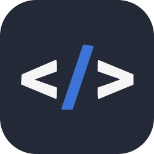      |
|      `husky`       |     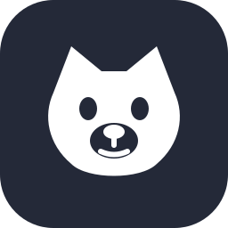      |
|       `idea`       |            |
|    `instagram`     |            |
|       `ipfs`       |            |
|       `java`       |            |
|     `jenkins`      |         |
|       `jest`       |                 |
|      `jquery`      |               |
|        `js`        |           |
|      `julia`       |           |
|       `jwt`        |      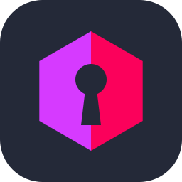       |
|      `kafka`       |                |
|       `kali`       |      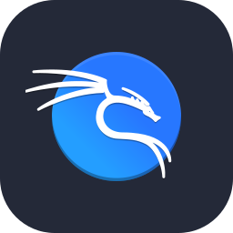      |
|      `kotlin`      |          |
|       `ktor`       |            |
|    `kubernetes`    |           |
|     `laravel`      |         |
|      `latex`       |           |
|       `less`       |            |
|     `linkedin`     |             |
|      `linux`       |           |
|       `lit`        |             |
|       `lua`        |             |
|     `mastodon`     |        |
|    `materialui`    |      |
|      `matlab`      |          |
|      `maven`       |           |
|        `md`        |        |
|       `mint`       |            |
|     `misskey`      |         |
|     `mongodb`      |              |
|      `mysql`       |           |
|      `neovim`      |          |
|      `nestjs`      |          |
|     `netlify`      |         |
|      `nextjs`      |          |
|      `nginx`       |                |
|       `nim`        |             |
|       `nix`        |             |
|      `nodejs`      |          |
|      `notion`      |     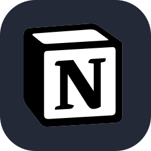     |
|       `npm`        |      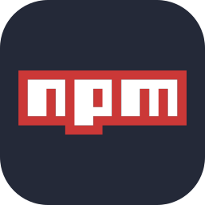       |
|      `nuxtjs`      |          |
|     `obsidian`     |    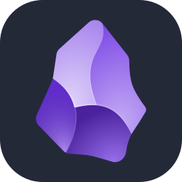    |
|      `ocaml`       |                |
|      `octave`      |          |
|      `opencv`      |          |
|    `openshift`     |            |
|    `openstack`     |       |
|      `oracle`      |               |
|       `p5js`       |                 |
|       `perl`       |                 |
|       `php`        |             |
|     `phpstorm`     |    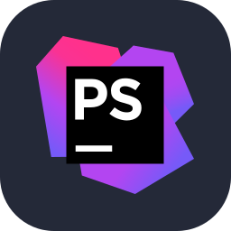    |
|      `pinia`       |           |
|       `pkl`        |      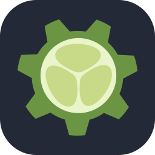       |
|      `plan9`       |           |
|   `planetscale`    |     |
|    `playwright`    |   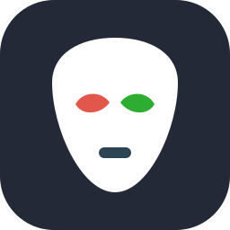   |
|       `pnpm`       |      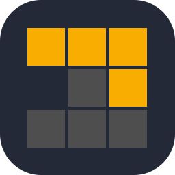      |
|     `postgres`     |      |
|     `postman`      |              |
|    `powershell`    |      |
|        `pr`        |             |
|     `prettier`     |    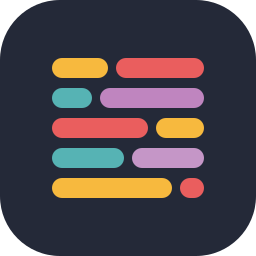    |
|      `prisma`      |               |
|    `processing`    |      |
|    `prometheus`    |           |
|        `ps`        |            |
|       `pug`        |             |
|        `py`        |          |
|     `pycharm`      |    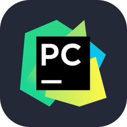     |
|     `pydantic`     |        |
|     `pytorch`      |         |
|        `qt`        |              |
|        `r`         |               |
|     `rabbitmq`     |        |
|      `rails`       |                |
|   `raspberrypi`    |     |
|      `react`       |           |
|    `reactivex`     |       |
|   `reactrouter`    |  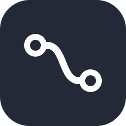   |
|      `redhat`      |          |
|      `redis`       |           |
|      `redux`       |                |
|      `regex`       |           |
|      `remix`       |           |
|      `render`      |       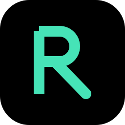        |
|      `replit`      |          |
|      `rider`       |     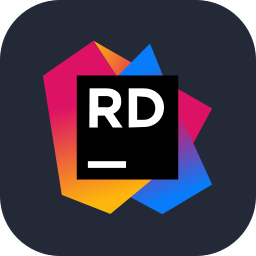      |
|   `robloxstudio`   |         |
|      `rocket`      |               |
|     `rollupjs`     |        |
|       `ros`        |             |
|       `ruby`       |                 |
|       `rust`       |                 |
|       `sass`       |                 |
|      `scala`       |           |
|     `selenium`     |             |
|      `sentry`      |               |
|    `sequelize`     |       |
|     `sketchup`     |        |
|     `sklearn`      |     |
|     `solidity`     |             |
|     `solidjs`      |         |
|     `spotify`      |         |
|      `spring`      |          |
|       `sql`        |             |
|      `sqlite`      |               |
|  `stackoverflow`   |   |
| `styledcomponents` |     |
|     `sublime`      |    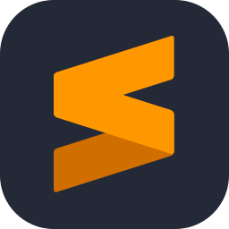     |
|     `supabase`     |        |
|      `svelte`      |               |
|       `svg`        |             |
|      `swift`       |                |
|     `symfony`      |         |
|     `tailwind`     |     |
|      `tauri`       |           |
|    `tensorflow`    |      |
|    `terraform`     |       |
|  `testinglibrary`  | 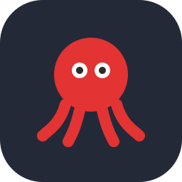 |
|     `threejs`      |         |
|        `ts`        |           |
|     `twitter`      |              |
|      `ubuntu`      |     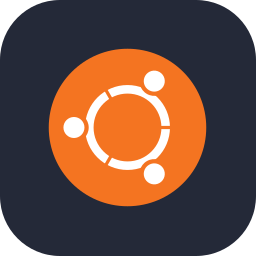     |
|      `unity`       |           |
|      `unreal`      |         |
|     `uvicorn`      |         |
|        `v`         |               |
|       `vala`       |                 |
|      `vercel`      |          |
|     `verilog`      |              |
|       `vim`        |             |
|   `visualstudio`   |    |
|       `vite`       |            |
|      `vitest`      |          |
|      `vscode`      |          |
|     `vscodium`     |        |
|       `vue`        |           |
|     `vuetify`      |    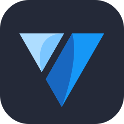     |
|       `wasm`       |          |
|     `webflow`      |              |
|     `webpack`      |         |
|    `websocket`     |   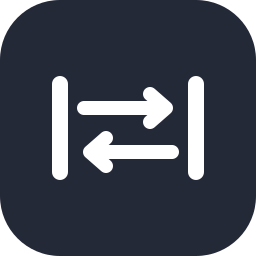    |
|     `webstorm`     |    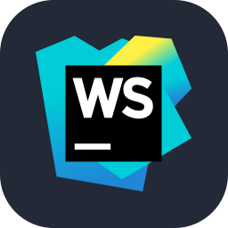    |
|     `windicss`     |        |
|     `windows`      |         |
|    `wordpress`     |            |
|     `workers`      |         |
|        `xd`        |                   |
|       `yarn`       |      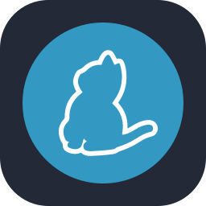      |
|       `yew`        |      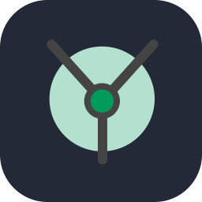       |
|       `zig`        |             |

## Estrutura do repositório

```
icons/                   os 255 ícones (429 arquivos, contando os pares de tema)
brand/                   assets da marca <gcruz.dev/> + o documento do DS
lib/icons.mjs            lógica compartilhada: resolução de nomes e composição
index.js                 entrada do Cloudflare Worker
api/*.mjs                entradas da Vercel
public/index.html        a página: galeria, montador e documentação
scripts/                 gerador da tabela do readme e dos assets da Vercel
build.js                 empacota icons/ em dist/icons.{json,mjs}
```

## Adicionar um ícone

1. Coloque o SVG em `icons/` seguindo as convenções abaixo.
2. `npm run readme` para regenerar a tabela.
3. Publique.

Convenções, as mesmas dos 255 que já existem:

- `viewBox="0 0 256 256"`, `width`/`height` 256, `fill="none"` na raiz
- fundo `<rect width="256" height="256" rx="60">`
- arte entre as coordenadas 41 e 215
- par temático `Nome-Dark.svg` (fundo `#242938`) + `Nome-Light.svg` (`#F4F2ED`);
  se o logo funciona sobre a cor da marca, use um arquivo único com essa cor
- **sem hífen no nome** além do sufixo de tema — o ID vem de `split('-')[0]`, e um
  terceiro segmento é ignorado pelo resolvedor
- **sem** `<text>`, `<style>`, `class=` ou referência externa; texto vira `<path>`
- **evite `id`/`<defs>`**; se precisar, prefixe com o nome do ícone — o endpoint
  concatena todos os ícones num único SVG, e `id` repetido entre ícones colide

## Créditos e licença

Este repositório é um fork de [skillicons.dev](https://skillicons.dev), criado por
[tandpfun](https://github.com/tandpfun), sob licença MIT. Se o projeto original
foi útil para você, considere apoiar o autor dele:
[ko-fi.com/thijsdev](https://ko-fi.com/Q5Q860KQ2).

Os logotipos de terceiros são marcas dos respectivos donos e aparecem aqui apenas
para identificação. A marca `<gcruz.dev/>` e os assets em `brand/` são de
Guilherme Cruz. JetBrains Mono é licenciada sob OFL-1.1.
